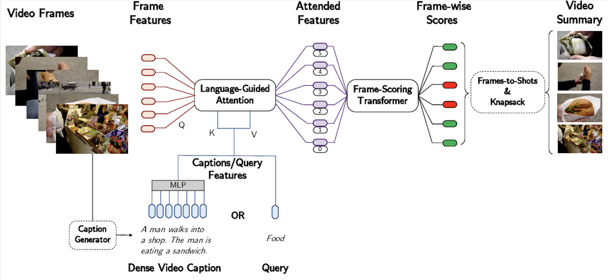

# CLIP-It!



## Overview

This is an unofficial PyTorch implementation of the following paper.

> **CLIP-It! Language-Guided Video Summarization**<br>
> Medhini Narasimhan, Anna Rohrbach, Trevor Darrell <br>
> https://arxiv.org/abs/2107.00650

## Installation
```bash
cd docker
docker build -t clipit .
```

## Usage

```python
import torch
from clip_it import CLIP_IT

device = torch.device('cuda')

clip_model_name = 'ViT-B/32'
num_sentences = 7
lgattn_n_heads = 4
transformer_kwargs = {
  'batch_first': True,
}

model = CLIP_IT(
  clip_model_name,
  num_sentences,
  lgattn_n_heads,
  transformer_kwargs
).to(device, torch.float32)

# (B, C, F, H, W)
videos = torch.randn(1, 3, 256, 128, 128).to(device)

texts = ['dummy'] * num_sentences

out = model(videos, texts)
# score (B, F)
print(out.shape)

```
